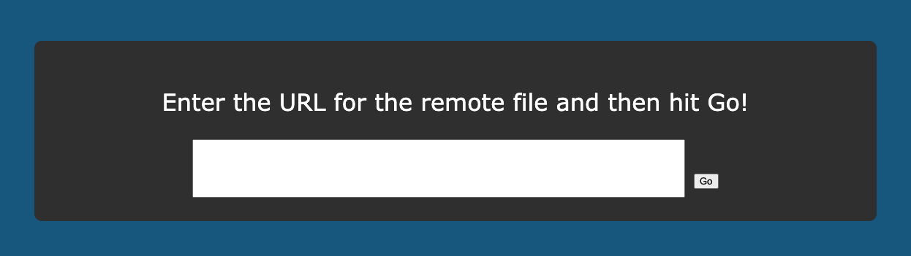

# Chiron-Primer

All the information you need to get started working with Rust using the Chiron tool!

---

- [Chiron-Primer](#chiron-primer)
  - [Running the Client](#running-the-client)
    - [Prerequisites](#prerequisites)
    - [Running on Mac OS](#running-on-mac-os)
    - [Running on Linux](#running-on-linux)
    - [Running on Windows](#running-on-windows)
    - [Generic Running](#generic-running)
  - [Loading content into the tool](#loading-content-into-the-tool)

---

## Running the Client

---

### Prerequisites

To run the Container you will need the [Docker Engine](https://www.docker.com/get-started/) installed on your machine. Additionally, Google Chrome and some kind of text-editor should be installed. The pre-configured start scripts assume you use Google Chrome as your default browser, and Visual Studio Code is installed on your machine.

If you do not use Chrome or Visual Studio Code, jump to [Generic Running](#generic-running) to see generic instructions.

---

### Running on Mac OS

To run the container on Mac OS:
  - Ensure Docker is installed and the Docker Engine is running
  - Open a Terminal Window
  - Execute the file `mac-start.sh` using the command `./mac-start.sh`
    - If there is a permissions issue, run `chmod 770 mac-start.sh` and then repeat the above step
  - This should open a Visual Studio Code window, and your browser
  - Enter the URL provided to you by the lecturer in the text box and hit go!

To stop the container, quit the Docker Engine or:
  - Run `docker container ls`
  - Your output should look like:

```
CONTAINER ID   IMAGE                                 COMMAND                  CREATED         STATUS
<some ID>      ssmay0/chiron-rust-client             "docker-entrypoint.s…"   2 hours ago     Up 2 hours
```

 - Run `docker delete <some ID>`

---

### Running on Linux

To run the container on Linux:
  - Ensure Docker is installed and the Docker Engine is running
  - Open a terminal window
  - Execute the file `linux-start.sh` using the command `./linux-start.sh`
    - If there is a permissions issue, run `chmod 770 linux-start.sh` and then repeat the above step
  - This should open a Visual Studio Code window, and your browser
  - Enter the URL provided to you by the lecturer in the text box and hit go!

To stop the container, quit the Docker Engine or:
  - Run `docker container ls`
  - Your output should look like:

```
CONTAINER ID   IMAGE                                 COMMAND                  CREATED         STATUS
<some ID>      ssmay0/chiron-rust-client             "docker-entrypoint.s…"   2 hours ago     Up 2 hours
```

 - Run `docker delete <some ID>`

---

### Running on Windows

Running on Windows can cause some strange compatibility issues, but should work if you do the following:
 - [Install Docker Desktop](https://www.docker.com/products/docker-desktop/)
   - Open Docker Desktop and accept the new license agreement
   - If WSL2 is not installed on your machine, this must be installed to enable the Docker Engine, use the [guide here to download and configure WSL2](https://docs.microsoft.com/en-us/windows/wsl/install). 
 - Open a terminal window in this repository and execute the file `windows-start.bat` by entering the name of the file. Double clicking the file may also start it appropriately. 

If you see a browser window to `localhost:8080` and a Visual Studio Code window open, everything has worked.

If you'd prefer to use a different text-editor, make sure you open the directory `%TEMP%\rust` to edit files.

---

### Generic Running

If your system is not covered by the above instructions, it is still possible to run the container and get started with Rust.

From some kind of Terminal Window:

```
docker pull ssmay0/chiron-rust-client
mkdir -p /tmp/rust
docker run -d -p 8080:8080 -v /tmp/rust:/host ssmay0/chiron-rust-client
```

Then open `/tmp/rust` in your favourite text-editor, and `http://localhost:8080` in your favourite browser.

---

## Loading content into the tool

When loading the page on `localhost:8080` you will see a page like the following:



In the text field enter the URL provided by the lecturer and if the content load is successful, you'll see the page containing the content and a terminal. 

If there is an issue loading the content, an error box will appear with more information.